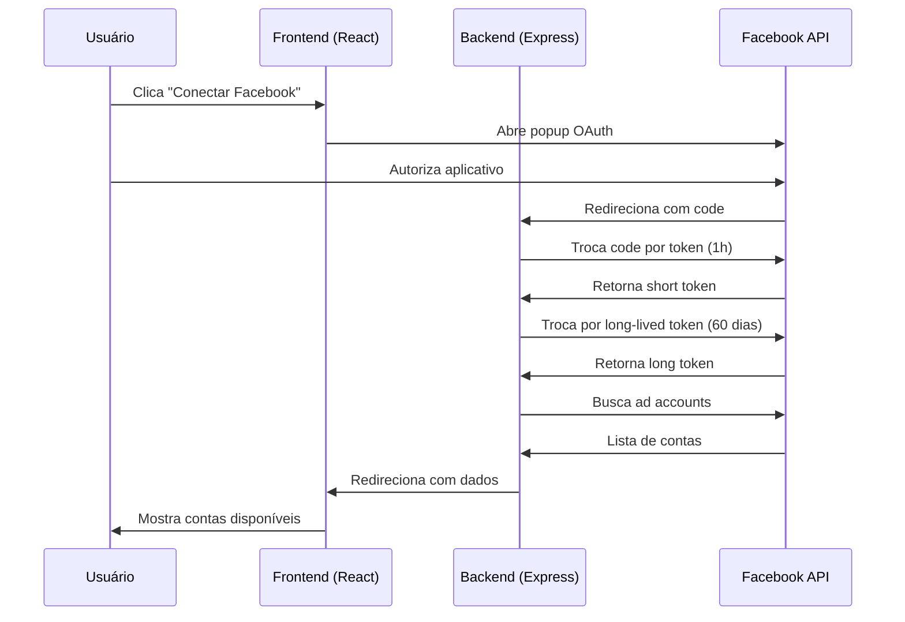

# 🚀 Nexus AI - Guia Completo de Setup

Este documento guia você pelo processo de configuração completa do sistema de autenticação OAuth 2.0 com Facebook Ads.

## 📋 Pré-requisitos

- Node.js 18+ instalado
- Conta de desenvolvedor na Meta (Facebook)
- Conta do Facebook com acesso a contas de anúncios

## 🔧 Passo 1: Configurar o App no Facebook

### 1.1. Criar Aplicativo

1. Acesse https://developers.facebook.com/apps
2. Clique em **"Criar App"**
3. Selecione o tipo **"Empresa"** ou **"Consumidor"**
4. Preencha os dados:
   - **Nome do App**: Nexus AI (ou o nome do seu produto)
   - **Email de contato**: seu email

### 1.2. Configurar Produtos

1. No menu lateral, vá em **"Adicionar Produto"**
2. Adicione o produto **"Login do Facebook"**
3. Clique em **"Configurações"** do Login do Facebook

### 1.3. Configurar Redirect URI

Na seção **"URIs de redirecionamento OAuth válidos"**, adicione:

```
http://localhost:3001/api/auth-callback
```

⚠️ **Importante**: Para produção, você adicionará sua URL real aqui (ex: `https://seuapp.com/api/auth-callback`)

### 1.4. Obter Credenciais

1. Vá em **"Configurações" > "Básico"** no menu lateral
2. Copie o **ID do Aplicativo** (App ID)
3. Copie a **Chave Secreta do App** (App Secret)

## 🔐 Passo 2: Configurar Variáveis de Ambiente

1. No arquivo `.env` na raiz do projeto, adicione suas credenciais:

```env
# Client-Side (Vite) - Exposto ao frontend
VITE_FACEBOOK_APP_ID="SEU_APP_ID_AQUI"
VITE_FACEBOOK_REDIRECT_URI="http://localhost:3001/api/auth-callback"
VITE_APP_URL="http://localhost:5173"

# Server-Side - Privado (NÃO usar prefixo VITE_)
FACEBOOK_APP_SECRET="SUA_CHAVE_SECRETA_AQUI"
```

⚠️ **NUNCA** compartilhe o `FACEBOOK_APP_SECRET` publicamente ou adicione `VITE_` no prefixo dele!

## 📦 Passo 3: Instalar Dependências

```bash
npm install
```

## 🚀 Passo 4: Iniciar o Aplicativo

### Opção 1: Iniciar tudo de uma vez (Recomendado)

```bash
npm run dev:all
```

Isso irá iniciar:
- ✅ Frontend (Vite) em `http://localhost:5173`
- ✅ Backend (Express) em `http://localhost:3001`

### Opção 2: Iniciar separadamente

**Terminal 1 - Frontend:**
```bash
npm run dev
```

**Terminal 2 - Backend:**
```bash
npm run dev:server
```

## 🔄 Passo 5: Testar o Fluxo OAuth

1. Abra o navegador em `http://localhost:5173`
2. Clique no botão **"Conectar Facebook Ads"**
3. Será aberto um popup oficial do Facebook
4. Faça login e autorize o aplicativo
5. Você será redirecionado de volta e verá suas contas de anúncios

## 🎯 Como Funciona o Fluxo



## 🔑 Tokens e Segurança

### Short-Lived Token
- ⏱️ Dura 1 hora
- 🔄 Trocado imediatamente por long-lived

### Long-Lived Token
- ⏱️ Dura 60 dias
- 💾 Salvo no banco de dados
- 🔄 Renovado automaticamente a cada 50 dias

### Como Renovar Token Automaticamente

O backend possui uma rota `/api/refresh-token` que deve ser chamada periodicamente:

```javascript
// Exemplo de renovação (implementar no n8n ou cron job)
const response = await fetch('http://localhost:3001/api/refresh-token', {
  method: 'POST',
  headers: { 'Content-Type': 'application/json' },
  body: JSON.stringify({ token: currentToken })
});
```

## 📊 Rotas Disponíveis no Backend

### `GET /api/auth-callback`
Recebe o callback do Facebook e troca o code por token.

### `POST /api/refresh-token`
Renova um token existente antes que expire.

**Body:**
```json
{
  "token": "EAAx..."
}
```

### `GET /api/campaigns/:adAccountId`
Busca todas as campanhas de uma conta específica.

**Headers:**
```
Authorization: Bearer {token}
```

### `POST /api/insights`
Busca métricas de campanhas específicas.

**Headers:**
```
Authorization: Bearer {token}
```

**Body:**
```json
{
  "adAccountId": "act_123",
  "campaignIds": ["123", "456"],
  "datePreset": "today"
}
```

## 🗄️ Próximos Passos: Integração com Banco de Dados

Para escalar o sistema, você precisará salvar os tokens em um banco de dados. Estrutura recomendada:

### Tabela: `users_tokens`

| Coluna | Tipo | Descrição |
|--------|------|-----------|
| id | uuid | ID único do usuário |
| fb_user_id | text | ID do usuário no Facebook |
| long_lived_token | text | Token de 60 dias |
| token_expires_at | timestamp | Data de expiração |
| whatsapp_number | text | WhatsApp para envio |
| created_at | timestamp | Data de criação |

### Tabela: `monitored_accounts`

| Coluna | Tipo | Descrição |
|--------|------|-----------|
| id | uuid | ID único |
| user_id | uuid | Foreign key para users_tokens |
| ad_account_id | text | ID da conta (ex: act_123) |
| account_name | text | Nome da conta |
| is_active | boolean | Se está monitorada |
| created_at | timestamp | Data de criação |

## 🔧 Troubleshooting

### Erro: "Pop-up bloqueado"
- Permita pop-ups no navegador para `localhost:5173`

### Erro: "redirect_uri não corresponde"
- Verifique se a URL no `.env` é EXATAMENTE a mesma configurada no Facebook
- A URL deve incluir protocolo (`http://`) e porta (`:3001`)

### Erro: "Token inválido"
- O token pode ter expirado (60 dias)
- Execute a renovação de token

### Erro: "Permissões insuficientes"
- Verifique se o usuário tem acesso à conta de anúncios
- Certifique-se de que o scope inclui `ads_read,read_insights`

## 📞 Suporte

Para dúvidas sobre a API do Facebook:
- [Documentação Facebook Marketing API](https://developers.facebook.com/docs/marketing-apis)
- [Tokens de Acesso](https://developers.facebook.com/docs/facebook-login/guides/access-tokens)

## 🎓 Recursos Adicionais

- **Renovação de Token**: Implementar cron job no n8n
- **Integração Supabase**: Para persistência de dados
- **Webhook WhatsApp**: Para envio de relatórios
- **IA (Gemini/OpenAI)**: Para geração de relatórios inteligentes
